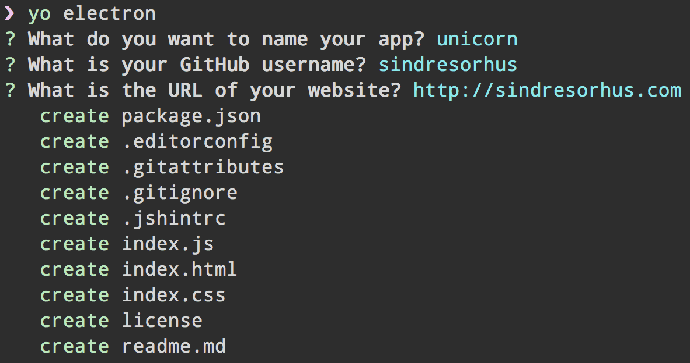

# generator-electron [](https://travis-ci.org/sindresorhus/generator-electron)

> Scaffold out an [Electron app boilerplate](https://github.com/sindresorhus/electron-boilerplate)



*See [awesome-electron](https://github.com/sindresorhus/awesome-electron) for more useful Electron resources.*


## Install

```
$ npm install --global generator-electron
```


## Usage

With [yo](https://github.com/yeoman/yo):

```
$ yo electron
```


## License

MIT © [Sindre Sorhus](http://sindresorhus.com)
